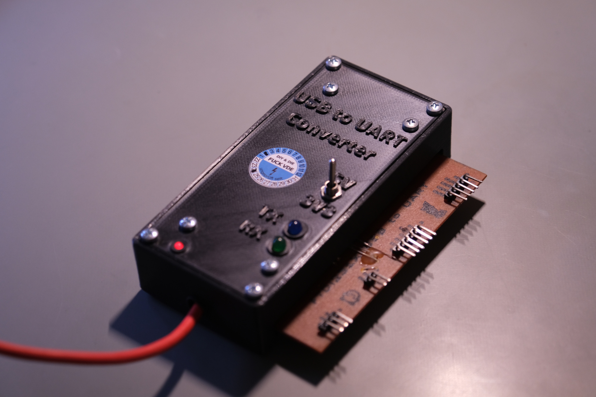
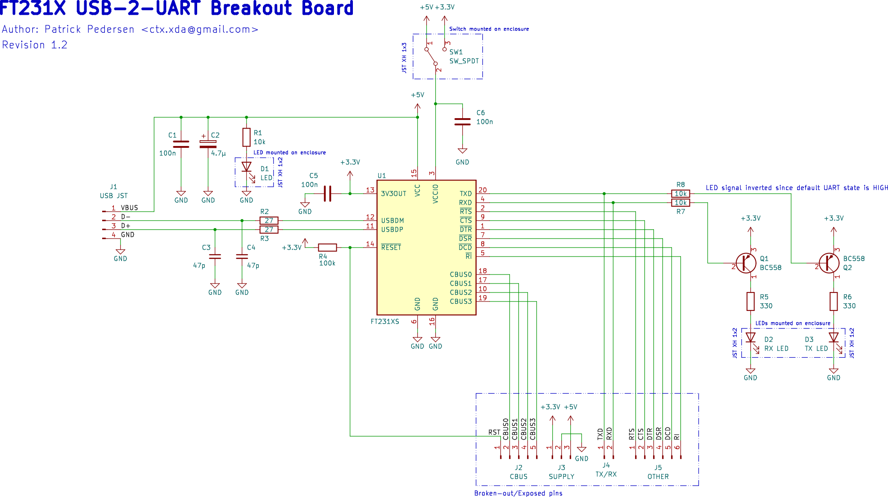
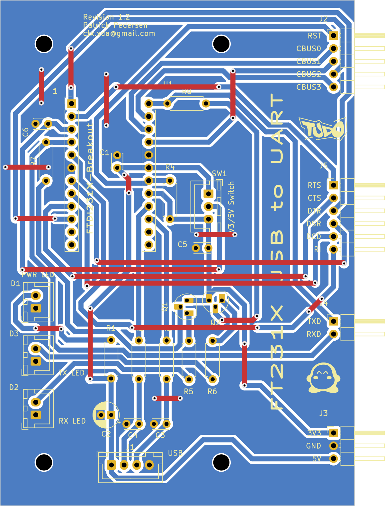
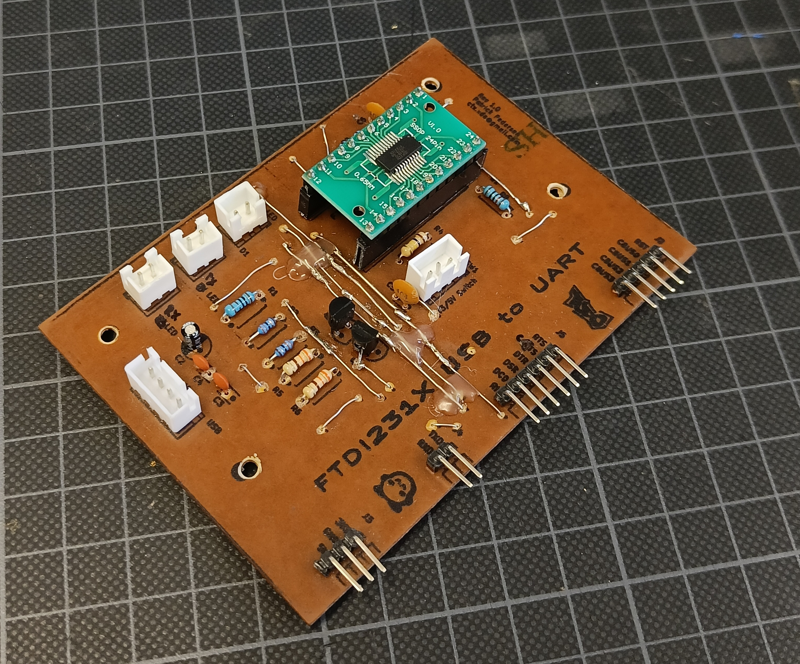
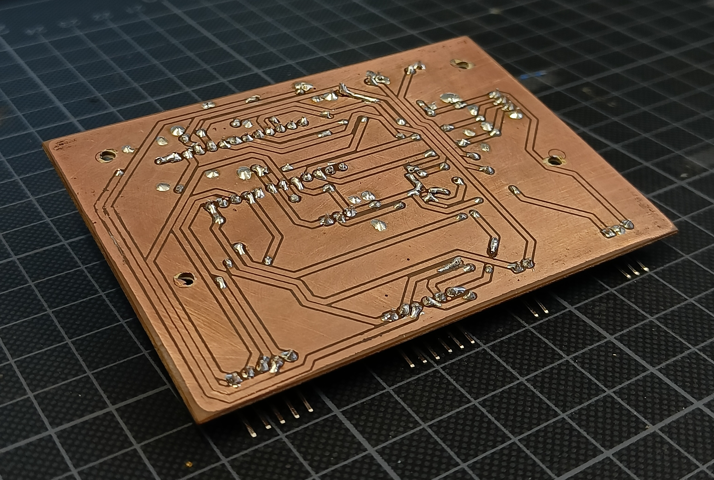
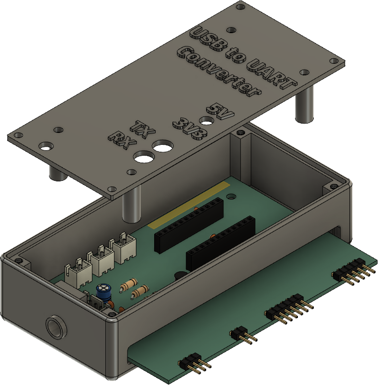

# FT231X USB 2 UART Breakout

This repository features a USB 2 UART converter/breakout board built on the FTDI FT231X IC. Although numerous affordable USB to UART converters are readily available on the market, this particular one was designed around a spare FT231X IC soldered to a SMD break-out adapter we had in our lab. Figured we'd make use of it then! The PCB was designed with a single-board layout in consideration, as we etched the PCB oursevles.

We don't really expect anyone to use this design, but we're making it available for archival purposes in case it breaks down some day or someone is simply curious about the design. However, if you do happen to find it useful, that's pretty awesome too!

## Schematic

The schematic pretty much provides the bare minimum to use the FT231X IC as a USB to UART converter. Some notable features include:

- A switch to switch between 3.3V and 5V logic levels
- LEDs to indicate power and data transmission
- Exposed supply, RX, TX, RTS, CTS, DTR, DSR, DCD, and RI pins
- Exposed CBUS pins for custom functionality

The data transmission LEDs have been implemented via the RX/TX lines. While it is possible to use the CBUS pins for this purpose, we decided to use the RX/TX lines to keep all CBUS pins exposed.

The schematic KiCAD file can be found in the `kicad` directory.

## PCB

The PCB was designed to be self-etched, and as such, it is a single-layer board. The front copper layer is only used to visualize jumpers. We used the "toner transfer method" to etch the PCB, which allows us to print a silk screen on to the non-conductive layer.

The PCB was designed in a way where the right side of the board breaks out the FT231X pins with angled 2.54mm male headers. The side of the board is then meant to "stick out" of the enclosure to allow for easy access to the pins. We also make heavy use of JST connectors so that the board can easily be removed from the enclosure and repaired or modified if necessary. The front silk-screen indicates the pinout of the FT231X IC, as well as the pinout of the JST connectors. This was done to make it easier to use the board without having to refer to the schematic.

The PCB KiCAD file can be found in the `kicad` directory.

## Enclosure

The enclosure was designed for 3D printing, intended to house most of the PCB, while leaving the right side of the board exposed for easy access to the break-out pins. This design choice also allows the silk-screen to be utilized for identifying the functionality of the break-out pins.

The 3mf files for the enclosure can be found in the `enclosure` directory.
